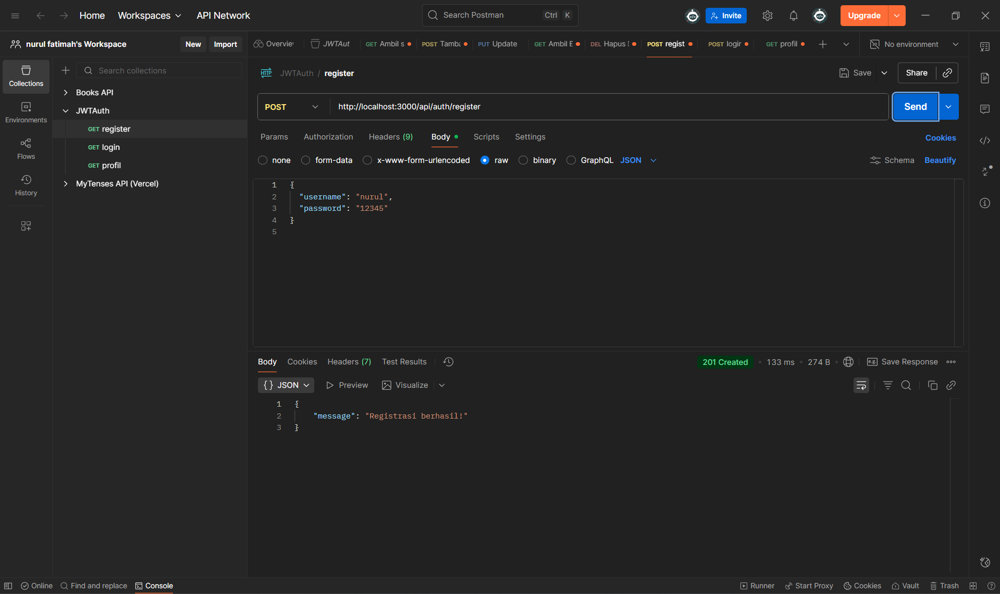
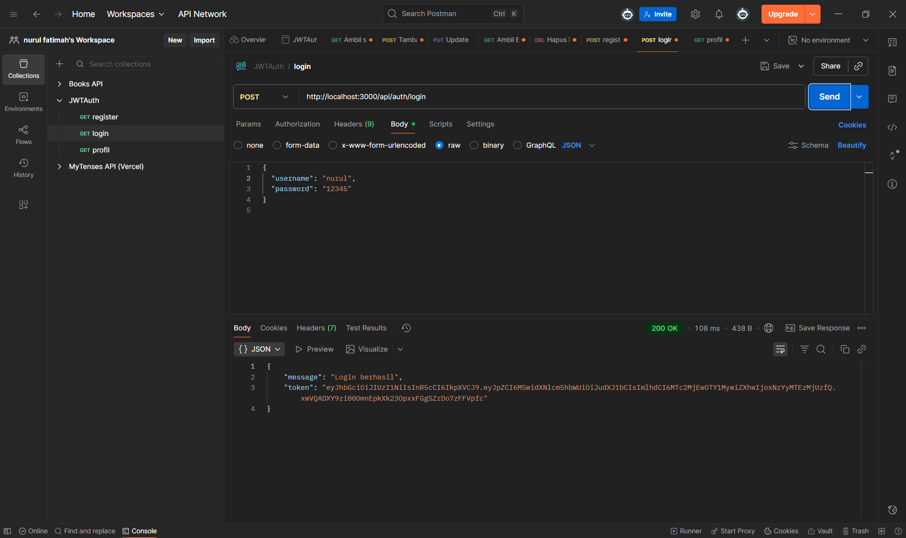
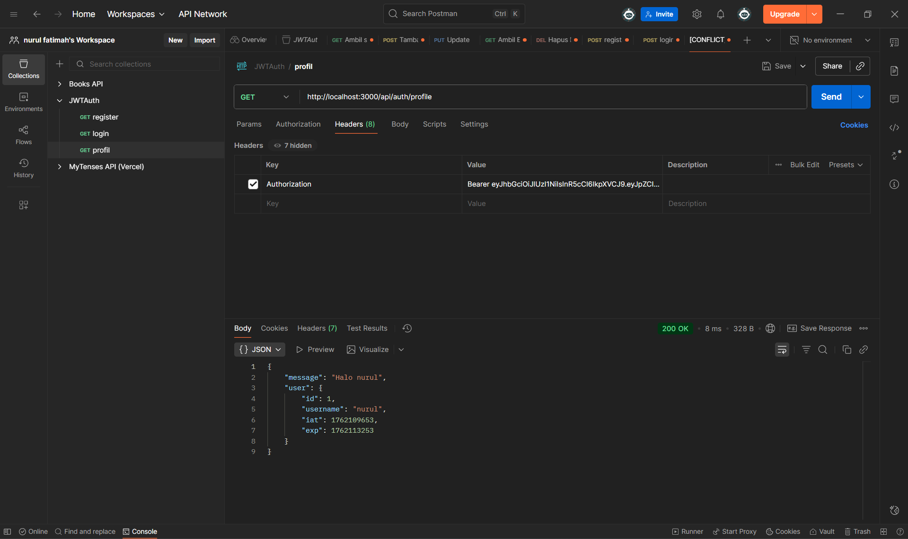
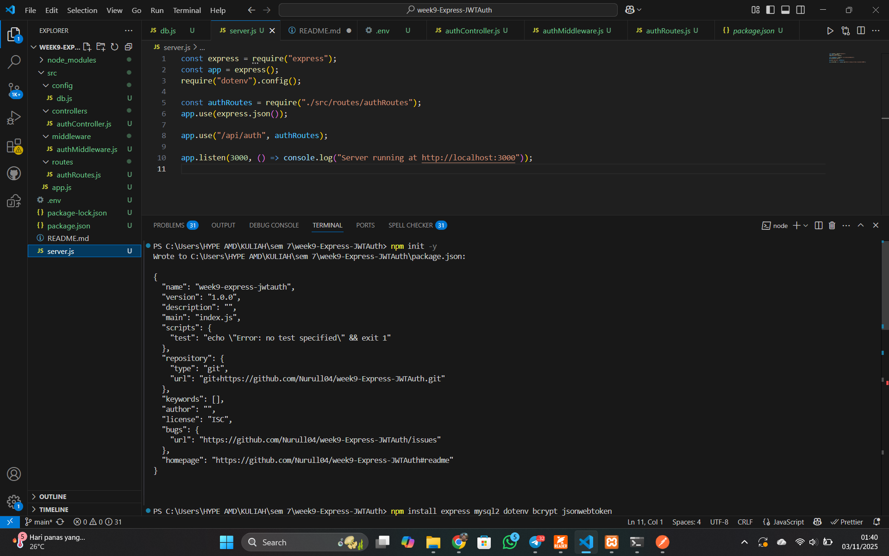
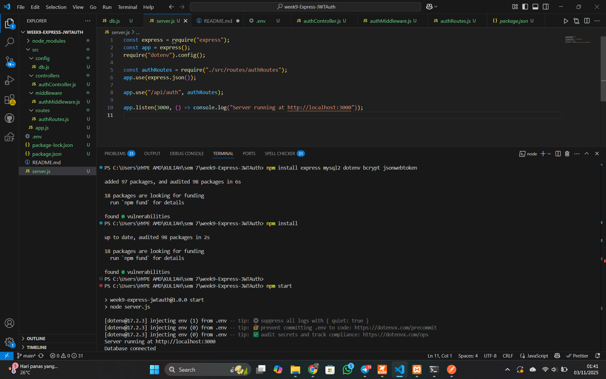

# Express JWT Authentication

## Deskripsi
Aplikasi ini dibuat menggunakan **Express.js** untuk menerapkan sistem **autentikasi menggunakan JSON Web Token (JWT)**.  
Tujuan dari proyek ini adalah agar hanya user yang sudah login yang bisa mengakses endpoint tertentu (protected route).  
Aplikasi ini juga menggunakan **bcrypt** untuk melakukan hashing password dan menyimpan data user secara aman di database **MySQL**.

---

## Fitur Aplikasi
- **Register user baru** (password di-hash dengan bcrypt)
- **Login user terdaftar** (menghasilkan JWT token)
- **Proteksi route** menggunakan middleware autentikasi JWT
- **Endpoint `/profile`** hanya dapat diakses menggunakan token valid
- Struktur modular (controllers, routes, middleware, config)
- File `.env` untuk konfigurasi rahasia
- Dilengkapi dengan **uji Postman** untuk memastikan fungsi autentikasi berjalan

## Teknologi & Library yang Digunakan
| Library / Teknologi | Fungsi |
|----------------------|--------|
| **Express.js** | Framework backend Node.js |
| **MySQL2** | Koneksi ke database MySQL |
| **dotenv** | Menyimpan variabel rahasia (secret, konfigurasi DB) |
| **bcrypt** | Meng-hash password agar tidak tersimpan dalam bentuk plain text |
| **jsonwebtoken (JWT)** | Membuat dan memverifikasi token autentikasi |
| **Postman** | Tools untuk menguji endpoint API |

## Langkah-langkah Pengerjaan

### 1. Inisialisasi Proyek
- npm init -y
- npm install express mysql2 dotenv bcrypt jsonwebtoken

### 2. Buat File .env
- JWT_SECRET=supersecretkey
### 3. Buat Database MySQL
- Masuk ke MySQL Shell (via XAMPP Shell / CMD) kemudian jalankan mysql -u root
- CREATE DATABASE authdb;
USE authdb;

CREATE TABLE users (
  id INT AUTO_INCREMENT PRIMARY KEY,
  username VARCHAR(100) UNIQUE NOT NULL,
  password VARCHAR(255) NOT NULL
);

## Cara Menjalankan Proyek
- Pastikan XAMPP (MySQL) sudah berjalan
- Jalankan aplikasi dengan menggunakan npm start
- Jalankan di Postman

## Screenshoot
## 1. Register 
**Output:**

## 2. Login 
**Output:**

## 3. Profile 
**Output:**

## run program di vscode
**Output:**

